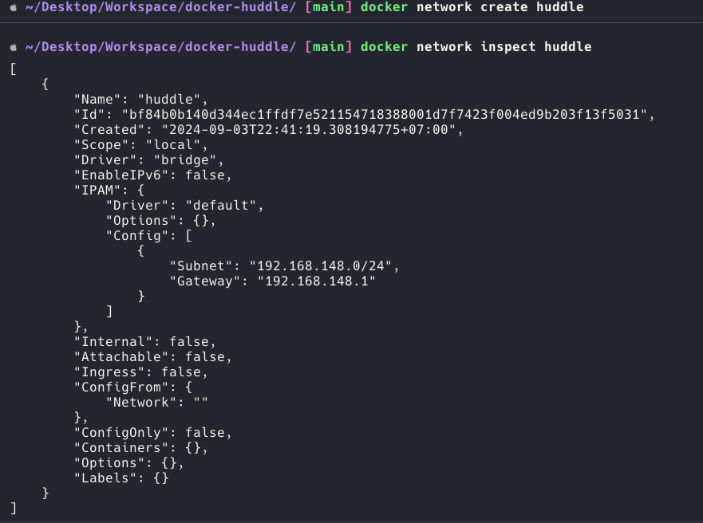

# What is Docker?

Docker is a platform for developing, shipping, and running applications in containers without concern in environment configuration or management.

## Containers vs. Virtual Machines

A comparison to illustrate how containers are lightweight, fast, and use fewer resources compared to VMs.

# Dockerfile

Dockerfile is a text file that contains a list of commands (instructions), which describes how a Docker image is built based on them. The command docker build tells Docker to build the image by following the content (instructions) inside the Dockerfile.

| **Instruction** | **Description**                                             |
| --------------- | ----------------------------------------------------------- |
| ADD             | Add local or remote files and directories.                  |
| ARG             | Use build-time variables.                                   |
| CMD             | Specify default commands.                                   |
| COPY            | Copy files and directories.                                 |
| ENTRYPOINT      | Specify default executable.                                 |
| ENV             | Set environment variables.                                  |
| EXPOSE          | Describe which ports your application is listening on.      |
| FROM            | Create a new build stage from a base image.                 |
| HEALTHCHECK     | Check a container's health on startup.                      |
| LABEL           | Add metadata to an image.                                   |
| MAINTAINER      | Specify the author of an image.                             |
| ONBUILD         | Specify instructions for when the image is used in a build. |
| RUN             | Execute build commands.                                     |
| SHELL           | Set the default shell of an image.                          |
| STOPSIGNAL      | Specify the system call signal for exiting a container.     |
| USER            | Set user and group ID.                                      |
| VOLUME          | Create volume mounts.                                       |
| WORKDIR         | Change working directory.                                   |

### ENTRYPOINT vs CMD

### ARG vs ENV

### ADD vs COPY

## Network

